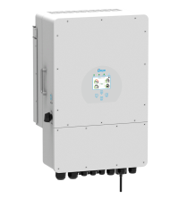

  

# IPSymcon-Modul: Deye PV Hybrid-Wechselrichter <!-- omit in toc -->  
 

## Inhaltsverzeichnis <!-- omit in toc -->

- [1. Funktionsumfang](#1-funktionsumfang)
- [2. Voraussetzungen](#2-voraussetzungen)
- [3. Software-Installation](#3-software-installation)
- [4. Einrichten der Instanzen in IP-Symcon](#4-einrichten-der-instanzen-in-ip-symcon)
- [5. Anhang](#5-anhang)
  - [1. GUID der Module](#1-guid-der-module)
  - [2. Changelog](#2-changelog)
- [6. Lizenz](#6-lizenz)

## 1. Funktionsumfang

Ermöglicht die Einbindung von 3-phasigen Hybridwechselrichtern der Firma Ningbo Deye in IPS.  
Es können mehrere Wechselrichter auf einem physikalischen RS485-Bus betrieben werden.  
Aktuell befindet sich das Modul noch in Entwicklung und noch nicht alle geplanten Funktionen sind umgesetzt.
Für dieses Modul besteht kein Anspruch auf Fehlerfreiheit, Weiterentwicklung, sonstige Unterstützung oder Support.
Bevor das Modul installiert wird, sollte unbedingt ein Backup von IP-Symcon durchgeführt werden.
Der Entwickler haftet nicht für eventuell auftretende Datenverluste oder sonstige Schäden.
Der Nutzer stimmt den oben angegebenen Bedingungen, sowie den Lizenzbedingungen ausdrücklich zu.

Folgende Module beinhaltet die Deye Library (vorerst):

- __SUN xxK_SG04LP3__  
	3-Phasen Wechselrichter vom Typ Deye SUN-xxK-SG04-LP3  

## 2. Voraussetzungen

 - IPS 5.1 oder höher  
 - Unterstützte Wechselrichter  
  Deye SUN-5K-SG04-LP3
  Deye SUN-6K-SG04-LP3
  Deye SUN-8K-SG04-LP3
  Deye SUN-10K-SG04-LP3
  Deye SUN-12K-SG04-LP3
 - physikalisches RS485-Interface bzw. RS485 to Ehternet Konverter  

## 3. Software-Installation

  Aktuell ist das Modul noch nicht über den Modulstore von IPSymcon ladbar. Sobald die finale Version ausgiebig getestet wurde, wird es jedoch im ModulStore verfügbar gemacht.
  Zur Installation im Objektbaum unter 
  
   **Bei kommerzieller Nutzung (z.B. als Errichter oder Integrator) wenden Sie sich bitte an den Autor.**  
  

## 4. Einrichten der Instanzen in IP-Symcon

Ist direkt in der Dokumentation der jeweiligen Module beschrieben:  

- __[SUN xxK-SG04LP3](SUNxxKSG04LP3/README.md#4-einrichten-der-instanzen-in-ip-symcon)__

## 5. Anhang

###  1. GUID der Module

 
|     Modul      |  Typ   |    Prefix    |                  GUID                  |
| :------------: | :----: | :----------: | :------------------------------------: |
| SUNxxKSG04LP3| Device |  SUNxxKSG04LP3   | {5A793A9B-ADEE-307E-20B7-FBE05C7B4C7E} |

### 2. Changelog

__Version 0.1:__
 - Erstes inoffizielles Release (Noch in Entwicklung!!!) 

 

## 6. Lizenz

  IPS-Modul:  
  [CC BY-NC-SA 4.0](https://creativecommons.org/licenses/by-nc-sa/4.0/)  
 
