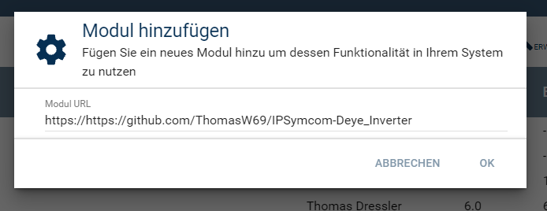
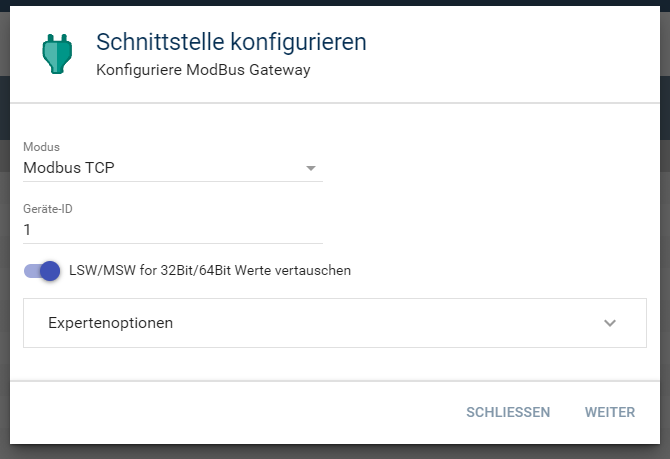
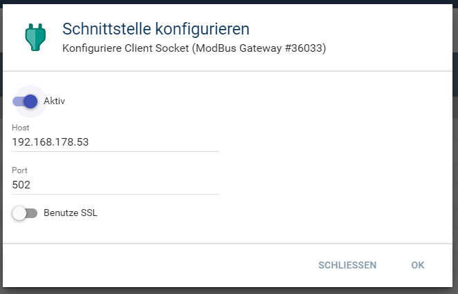
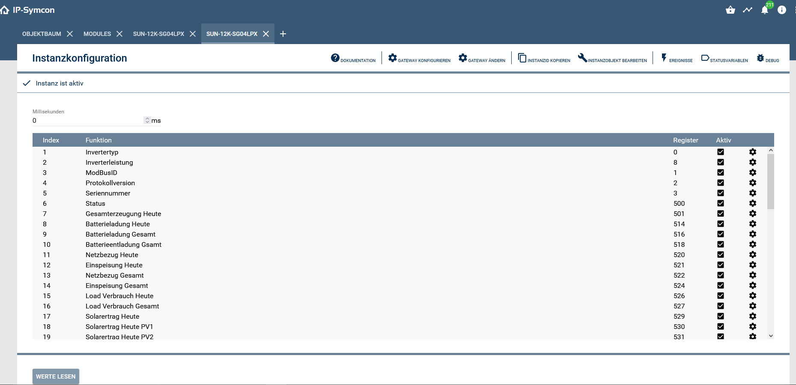
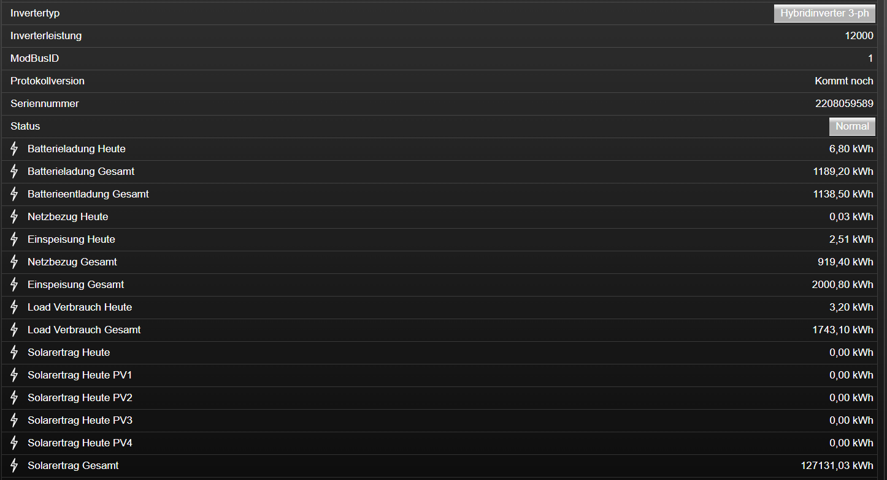
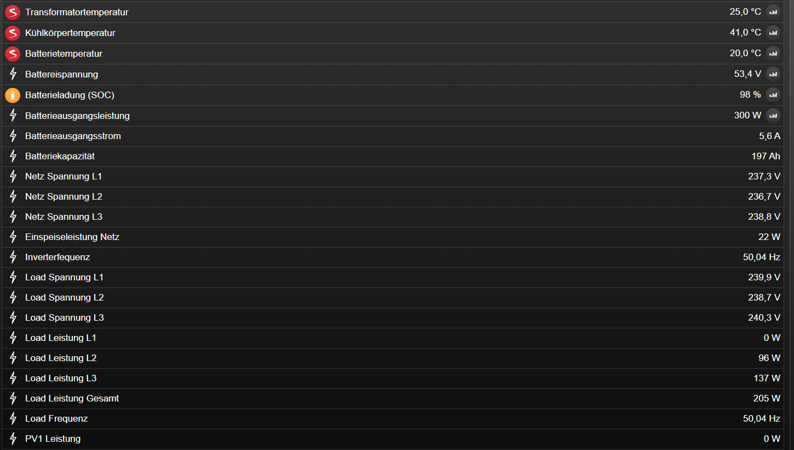
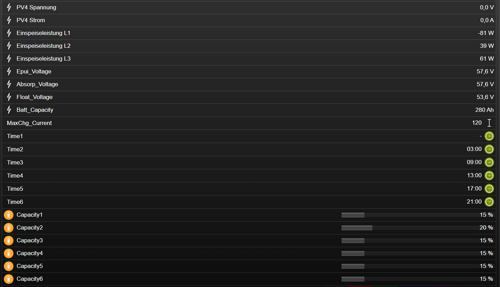
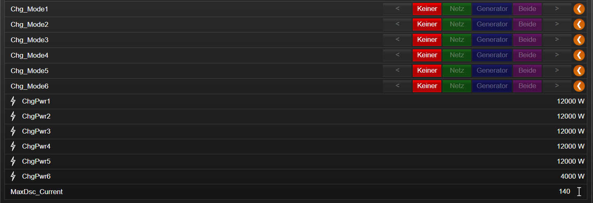

  

# SUN xxK-SG04LP3 <!-- omit in toc -->  

## Inhaltsverzeichnis <!-- omit in toc -->

- [1. Funktionsumfang](#1-funktionsumfang)
- [2. Voraussetzungen](#2-voraussetzungen)
- [3. Software-Installation](#3-software-installation)
- [4. Einrichten der Instanzen in IP-Symcon](#4-einrichten-der-instanzen-in-ip-symcon)
- [5. Konsole](#5-konsole)
- [6. PHP-Befehlsreferenz](#6-php-befehlsreferenz)
- [7. Anhang](#7-anhang)
  - [1. Changelog](#1-changelog)
- [8. Lizenz](#8-lizenz)

## 1. Funktionsumfang

Ermöglicht die einfache Einbindung von PV Hybridwechselrichtern des Typs SUN-xxK-SG04LP3 der Firma Deye.  
Es können mehrere Wechelrichter auf einem physikalischen RS485-Bus bzw über Modbus-Splitter betrieben werden.  

## 2. Voraussetzungen

 - IPS 5.1 oder höher  
 - Deye SUN-xxK-SG04-LP3 Wechselrichter mit **ModBus-Interface**  
 - 
## 3. Software-Installation

Zur Installation des Moduls im Objektbaum unter den Kerninstanzen "Modules" Auswählen.
Ist "Modules" geöffnet unten rechts in der Ecke auf das "+" klicken.
Im sich Öfnenden Dialog https://github.com/ThomasW69/IPSymcom-Deye_Inverter eingeben und OK Klicken.
 

## 4. Einrichten der Instanzen in IP-Symcon

Das Modul ist im Dialog 'Instanz hinzufügen' unter dem Hersteller 'Ningbo Deye Solar' zu finden.  
  

Es wird automatisch ein 'ModBus Gateway' als Splitter-Instanz, sowie ein 'Client Socket' als dessen I/O-Instanz erzeugt.  
Hier muss jetzt der Modus passend zur Hardwareanbindung (TCP /RTU) sowie die Geräte-ID des Deye eingestellt und übernommen werden.  

Anschließend über den Button 'Weiter' das Konfigurationsformular der I/O-Instanz öffnen.  
Je nach Hardwareanbindung müssen hier die RS485 Parameter oder die IP-Adresse des ModBus-Umsetzers eingetragen werden.  
Details hierzu sind dem Handbuch des Deye (RS485) und dem eventuell verwendeten Umsetzer zu entnehmen.  

In dem sich öffnenden Konfigurationsformular muss der Abfrage-Zyklus eingestellt werden. Dieser gibt an alle wieviel Millisekunden das Modul den Deye abfragt. In der Regel sind 2000 ms ausreichend. Bei eingabe von 0 ms wird die automatische Abfrage deaktiviert. Zu kleine Werte führen zu fehlerhaftem Auslesen.

Die Eingaben für Solarbasierte Optimierung und Variabler Energietarif sind noch nicht belegt. Diese dienen in Zukunft dazu, den Speicher entsprechend der für den tag zu erwartenden Solarprognose zu Zeiten mit Geringem Stompreis über einen variablen Stromtarif (Tibber, Awattar) zu beladen wenn der Solarertrag zu gering ist.
    

Damit ist die Konfiguration im Prinzip shcon abgeschlossen und die INstanz kann in die Visualisierung eingebunden werden. Die ANgelegten Variablen können selbstverständlich auch geloggt werden. 

## 5. Visualisierung

Die Darstellung in der Visualisierung.  
 
 
 
 

## 6. PHP-Befehlsreferenz

kommt noch

## 7. Anhang

### 1. Changelog

[Changelog der Library](../README.md#2-changelog)

## 8. Lizenz

  IPS-Modul:  
  [CC BY-NC-SA 4.0](https://creativecommons.org/licenses/by-nc-sa/4.0/)  
 
